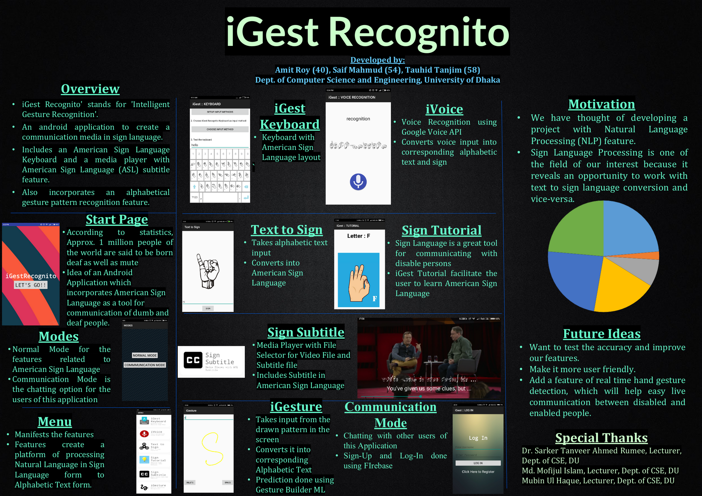

# iGestRecognito
'iGest Recognito' stands for 'Intelligent Gesture Recognition'. An android application to create a communication media in sign language using Text to Sign conversion and vice-versa. It includes a American Sign Language Keyboard and a media player with American Sign Language (ASL) subtitle feature. It also incorporates an alphabetical gesture pattern recognition feature.

**Developed by:**
- [Amit Roy](https://amitroy7781.github.io)
- [Saif Mahmud](https://saif-mahmud.github.io)
- [Tauhid Tanjim](https://github.com/Tanjim13)

**Features:**
- Keyboard with American Sign Language Layout
- Converter of Voice Input into corresponding Alphabetic and Sign Language Text
- Alphabetic Text to Sign Language Converter
- American Sign Language Tutorial
- Media Player with American Sign Language Subtitle
- Pattern Recognition of Alphabetic Gesture on screen

[Check out the youtube video !!](https://youtu.be/Xizm56YwncY)

This mobile application has been awarded as Champion at DUITS-ROBI National IT Fest, 2018 ([Results](https://www.facebook.com/events/246565332872634/?post_id=254072218788612&view=permalink)) and presented as a [poster](https://drive.google.com/file/d/1GZoKBmeiM-RHmjT7Iy-YgQ1SJGbBkPn4/view?usp=sharing) in International conference on Emerging technologies in data Mining and Information Security(IEMIS), 2018 in Kolkata, India.
